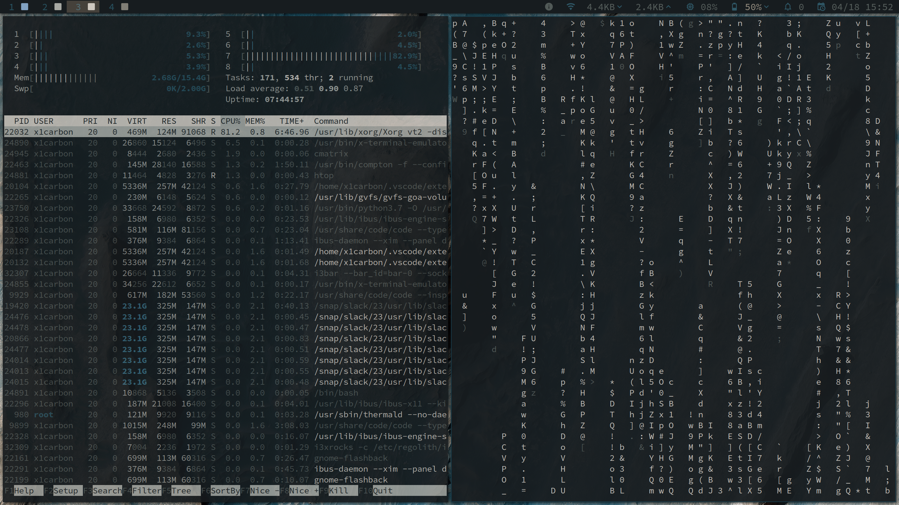
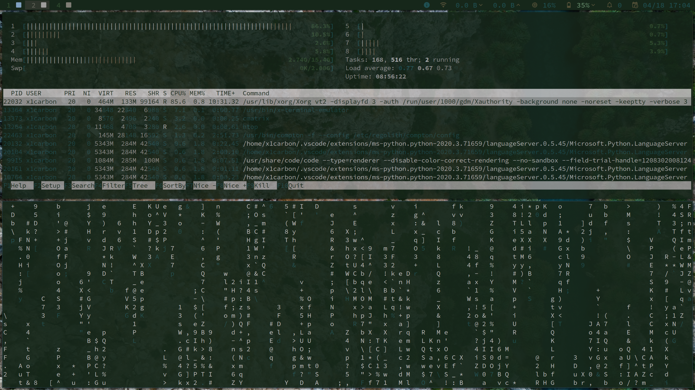

# Regowal

Regowal is a theme generator for Regolith-linux
https://regolith-linux.org/ /// https://github.com/regolith-linux

Dependancies include <code>python 3.7</code> and <code>imagemagick</code> and of course Regolith-Linux v1.3 or higher

Regowal setup will create a hidden directory at ~/.regowal and point your ~/.Xresources-regolith to it.

Once setup.py is complete use regowal + image to set up a theme. Regowal will copy your image to the hidden theme folder for safe keeping.

<code>./regowal <full path to img></code>

Sometimes a manual <code>regolith-look refresh</code> is needed to fully update the wallpaper

<bold>HOW TO INSTALL</bold>

<code>sudo apt install git imagemagick</code>

<code>cd ~/Documents</code>

<code>git clone https://github.com/JollyRogerTrader/Regowal.git</code>

<code>cd Regowal</code>

<code>python3 setup.py</code>

<bold>HOW TO USE</bold>

Navigate to the directory where regowal is saved (~/Documents/Regowal)

<code>./regowal ~/full path to img</code>

note: you do not need to run setup.py more than once or if you deleted the Regowal theme from your home directory.

<bold>HOW TO RESET</bold>

<code>regolith-look set cahuella && regolith-look refresh</code>

currently Regowal is only updating i3 colors. Rofi + GTK colors are in progress. If your ~/.Xresources-regolith has additional settings then ensure you have a backup prior to running <code>python3 setup.py</code> this script is still in development and something might break. you can backup your .Xresources-regolith file with <code>cp ~/.Xresources-regolith .Xresources-regolith.bk</code>

