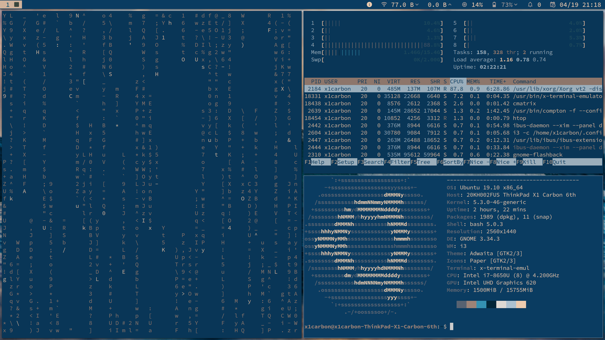

# Regowal

Regowal is a theme generator for Regolith-linux

https://regolith-linux.org/ /// https://github.com/regolith-linux

Dependancies include <code>python 3.7</code> and <code>imagemagick</code>

Regowal setup will create a directory ~/Regowal and point your .Xresources-regolith to it.To run setup, navigate to the directory where setup is in a terminal and run
<code>python3 setup.py</code>

Once setup.py is complete use regowal + image to set up a theme
<code>./regowal <full path to img></code>

Sometimes a manual <code>regolith-look refresh</code> is needed to fully update the wallpaper

The theme can be reset to the default Regolith-linux theme with
<code>regolith-look set cahuella && regolith-look refresh</code>

currently Regowal is only updating i3 colors. Rofi + GTK colors are in progress. If your ~/.Xresources-regolith has additional settings then ensure it's backup prior to running <code>python3 setup.py</code> this script is still in development and something might break. you can backup your .Xresources-regolith file with <code>cp ~/.Xresources-regolith .Xresources-regolith.bk</code>

